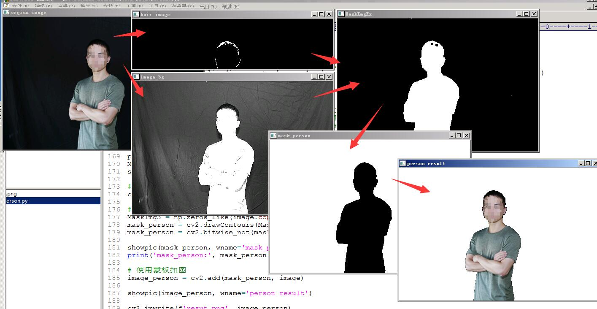
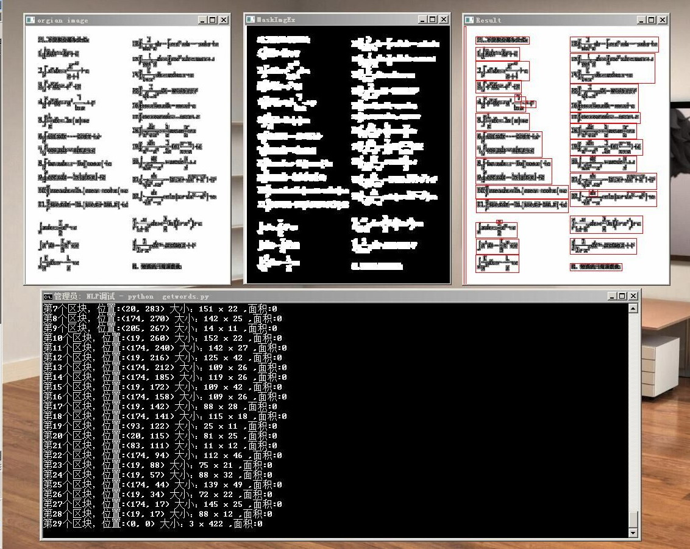

# 基于CV2的图像流式处理

## 思路

对图像的各类处理，基本上都是对图像进行一系列的不同处理，把这些处理操作进行分支、叠加等，最终得到某些结果；

所以可以先将基础操作独立出来，然后包装一个“流式”处理的库，比如叫pipeline， 这样就可以把重点关注在操作节点以及每个节点的参数上；

## 使用

库名：cv2lib.py
引用库：

```python 
from cv2lib import *
```


调用pipeline：

```python 
image = pipline(image, 
                [
                (resize, (0.5,0.5)), # 各个操作；
                ],
                showimg=0, # 是否显示过程
                showresult=1, # 是否显示结果；
                wname='orgian image' #显示窗口的名称
                )
```


## 例子

　
这里有两个例子：

例子一： 提取人像全身，包括头发；

```
python person.py
```

运行结果图：



例子二： 提取文本区域

```
python getwords.py
```

运行结果图：




## 待完善

* 加入更多的基础操作节点；

* 类似于例子一中的分支流程，需要将两个分支处理后的结果合并，
对于这类流程还没有包装；


